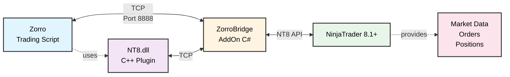

# NinjaTrader 8 Zorro Plugin

A full-featured Zorro broker plugin for automated trading via NinjaTrader 8.1+ using TCP bridge architecture.

[](https://opensource.org/licenses/MIT)
[](https://isocpp.org/)
[](https://ninjatrader.com/)
[](https://zorro-project.com/)

## 🚀 Features

- ✅ **Live Trading** - Market & limit orders with real-time fills
- ✅ **Real-Time Data** - Bid, Ask, Last, Volume from NT8 data feeds
- ✅ **Position Tracking** - Net position and average entry price
- ✅ **Account Management** - Balance, margin, P&L tracking
- ✅ **Symbol Conversion** - Automatic futures contract format conversion
- ✅ **TCP Architecture** - Clean separation, works with NT8 8.1+

## 🏗️ Architecture



**Components:**
- **NT8.dll** - Zorro broker plugin (C++17, 32-bit)
- **ZorroBridge.cs** - NinjaScript AddOn for NT8 8.1+
- **TCP Bridge** - localhost:8888 communication layer

## 📋 Requirements

### Build Requirements
- **Visual Studio 2019+** with C++ workload
- **CMake 3.15+**
- **Windows SDK**
- **NinjaTrader 8.1+** (for AddOn compilation)

### Runtime Requirements
- **NinjaTrader 8.1+** (free version works!)
- **Zorro 2.62+**
- **Windows 10/11**
- **Data Feed** (for live trading - sim data works for testing)

## 🛠️ Installation

### Quick Start

```bash
# 1. Clone repository
git clone https://github.com/algoboss710/ninjatrader-zorro-plugin.git
cd ninjatrader-zorro-plugin

# 2. Build plugin (32-bit required for Zorro)
mkdir build
cd build
cmake -G "Visual Studio 17 2022" -A Win32 ..
cmake --build . --config Release

# 3. Install
copy Release\NT8.dll C:\Zorro\Plugin\
```

### Complete Installation

See **[Installation Guide](docs/INSTALLATION.md)** for detailed instructions including:
- NinjaScript AddOn setup
- Zorro configuration
- Account setup
- Verification steps

## 🎮 Quick Test

After installation:

1. **Copy test script:**
   ```bash
   copy scripts\NT8Test.c C:\Zorro\Strategy\
   ```

2. **Configure Zorro account** (`C:\Zorro\History\accounts.csv`):

3. **Run test:**
   - Start NinjaTrader 8
   - Start Zorro
   - Select **NT8-Sim** account
   - Select **NT8Test** script
   - Click **Trade**

Expected output:
```
[PASS] Plugin loaded
[PASS] Account Info
[PASS] Market Data
[PASS] Position Query
[PASS] System Info
Plugin Status: OPERATIONAL
```

## 📊 Symbol Format

The plugin automatically converts between formats:

| Zorro Format | NT8 Format | Description |
|--------------|------------|-------------|
| `MESH26` | `MES 03-26` | MES March 2026 |
| `ESH26` | `ES 03-26` | ES March 2026 |
| `MES 0326` | `MES 03-26` | Alternative format |
| `MES 03-26` | `MES 03-26` | Direct NT8 format |

**Month Codes:** H=Mar, M=Jun, U=Sep, Z=Dec

## 🔧 API Overview

### Implemented Functions

| Function | Description | Status |
|----------|-------------|--------|
| `BrokerOpen` | Initialize plugin | ✅ |
| `BrokerLogin` | Connect to NT8 via TCP | ✅ |
| `BrokerTime` | Get server time, keep-alive | ✅ |
| `BrokerAsset` | Subscribe & get market data | ✅ |
| `BrokerAccount` | Get account info | ✅ |
| `BrokerBuy2` | Place orders | ✅ |
| `BrokerSell2` | Close positions | ✅ |
| `BrokerTrade` | Query order status | ✅ |
| `BrokerCommand` | Extended commands | ✅ |

### Example Usage

```c
function run()
{
    BarPeriod = 1;
    LookBack = 0;  // Live-only (no historical data)
    
    asset("MESH26");  // MES March 2026
    
    // Get position
    int pos = brokerCommand(GET_POSITION, SymbolTrade);
    
    // Simple strategy
    if(pos == 0 && priceClose() > priceClose(1))
        enterLong(1);  // Buy 1 contract
    
    if(pos > 0 && priceClose() < priceClose(1))
        exitLong();    // Close position
}
```

See **[API Reference](docs/API_REFERENCE.md)** for complete documentation.

## 📁 Project Structure

```
ninjatrader-zorro-plugin/
|-- include/
|   |-- NT8Plugin.h          # Plugin interface
|   |-- TcpBridge.h          # TCP communication
|   +-- trading.h            # Zorro types
|-- src/
|   |-- NT8Plugin.cpp        # Main implementation
|   |-- TcpBridge.cpp        # TCP bridge
|   +-- NT8Plugin.def        # DLL exports
|-- ninjatrader-addon/
|   +-- ZorroBridge.cs          # NT8 AddOn (C#)
|-- scripts/
|   |-- NT8Test.c            # Comprehensive test
|   +-- SimpleNT8Test.c      # Quick test
|-- docs/                    # Documentation
|-- CMakeLists.txt
|-- README.md
+-- LICENSE
```

## 🐛 Troubleshooting

### "Failed to connect to NinjaTrader AddOn"

**Solutions:**
1. Verify NinjaTrader is running
2. Check Output window shows: `[Zorro ATI] Zorro ATI Bridge listening on port 8888`
3. Recompile AddOn (F5 in NinjaTrader)
4. Restart NinjaTrader

### "No bars generated"

**Solutions:**
1. Set `LookBack = 0` in your script
2. Make sure market is open or use sim/replay data
3. Verify data feed connected in NinjaTrader

### More Issues?

See **[Troubleshooting Guide](docs/TROUBLESHOOTING.md)** for complete solutions.

## 📝 Documentation

| Document | Description |
|----------|-------------|
| **[Installation Guide](docs/INSTALLATION.md)** | Complete setup instructions |
| **[Getting Started](docs/GETTING_STARTED.md)** | Tutorial for first trades |
| **[API Reference](docs/API_REFERENCE.md)** | Complete API documentation |
| **[Troubleshooting](docs/TROUBLESHOOTING.md)** | Common issues & solutions |
| **[Changelog](CHANGELOG.md)** | Version history |

## 🔬 Testing

Test scripts in `scripts/` folder:

- **NT8Test.c** - Comprehensive feature test

Copy to `C:\Zorro\Strategy\` and run in Zorro.

**Playback Testing:** Use NinjaTrader's Simulated Data Feed to test Broker API.

## 📝 Known Limitations

| Feature | Status | Notes |
|---------|--------|-------|
| Contract Specs | ⚠️ | Configure in Zorro asset file |
| Multi-Account | ⚠️ | One account at a time |
| Stop Orders | 🚧 | Planned for v1.1 |
| Bracket Orders | 🚧 | Planned for v2.0 |

## 🗺️ Roadmap

### v1.0 (Current) ✅
- TCP bridge architecture
- Live trading (market & limit orders)
- Real-time data
- Account management
- Symbol conversion

### v1.1 (Planned)
- Stop-loss orders
- Take-profit orders
- Order modification
- Enhanced error handling

### v2.0 (Future)
- Historical data support
- Multi-account support
- OCO orders
- Bracket orders

## 🤝 Contributing

Contributions welcome! Please:

1. Fork the repository
2. Create a feature branch
3. Test thoroughly (simulation account minimum)
4. Submit pull request

See **[CONTRIBUTING.md](CONTRIBUTING.md)** for detailed guidelines.

## 📄 License

MIT License - See [LICENSE](LICENSE) file

**Free to use for commercial and personal trading.**

## 🙏 Acknowledgments

- [Zorro Project](https://zorro-project.com) - Algorithmic trading platform
- [NinjaTrader](https://ninjatrader.com) - Trading platform & API
- Community contributors and testers

## 📞 Support

- **Issues:** [GitHub Issues](https://github.com/algoboss710/ninjatrader-zorro-plugin/issues)
- **Documentation:** [docs/](docs/) folder
- **Zorro Insight:** [financial-hacker.com](https://financial-hacker.com)
- **Zorro Forum:** [forum.zorro-project.com](https://opserver.de/ubb7/ubbthreads.php?ubb=cfrm&c=1)
---

**⚠️ Trading Risk Disclaimer:** Trading involves substantial risk of loss. This software is provided as-is for educational purposes. Always test thoroughly with simulation accounts before live trading. Past performance does not guarantee future results.

---

**Built with ❤️ for automated traders**
